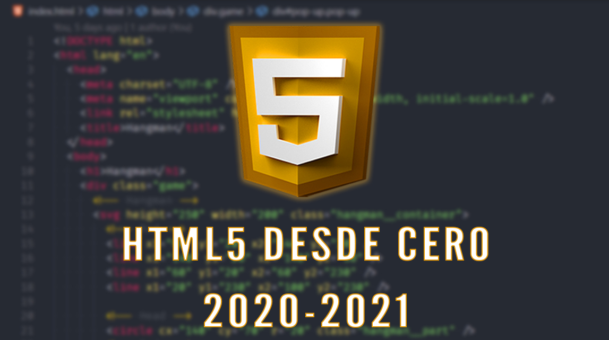

# Curso de HTML 2020 / 2021

## Contenido

- Historia
- Estructura
- Sintaxis
- Encabezados
- Etiqueta main
- Header y footer
- Article y section
- Aside
- Elementos de bloque
- Elementos de línea
- Atributos
- Enlaces
- Rutas
- Listas
- Tablas i
- Tablas ii
- Tablas iii
- Tablas iv
- Formularios
- Otras etiquetas de bloque
- Otras etiquetas de línea

---
 Lista de reproducción del Curso de HTML 2020/2021 de DorianDesings

 DorianDesings

---
