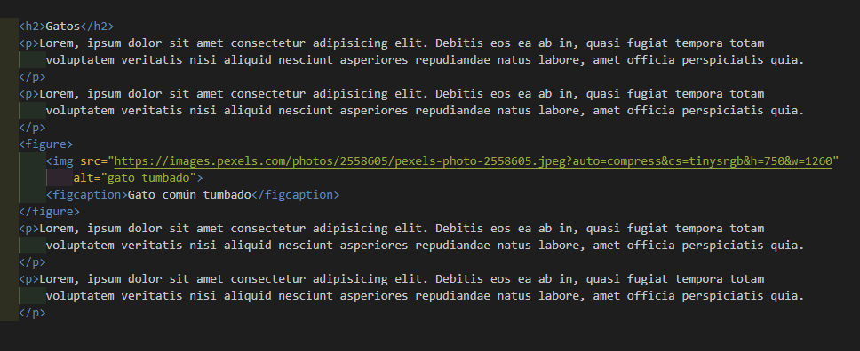

# Etiqueta figure

[Inicio |](README.md) [Anterior |](10iframes.md) [Siguiente](12meta.md)  

La etiqueta `<figure>` se utiliza para agregar contenido relacionado al artículo pero que es opcional que esté.
Es decir, si lo quitáramos, el artículo sigue teniendo sentido.

Se utiliza siempre que se quiera romper el flujo del contenido con un contenido relacionado pero que no es necesario para la interpretación del articulo. Es decir, si lo quitáramos, el artículo sigue teniendo sentido.

De forma opcional también tenemos la etiqueta `<figcaption>`, que sirve simplemente para ponerle un texto descriptivo a la imagen.
Se puede colocar por encima de la imagen como por debajo, pero lo más habitual es ponerlo por debajo de la imagen.

Tomemos como ejemplo este articulo hablando de gatos donde incluimos una etiqueta `<figure>` para la imagen del gato junto a un `<figcaption>` para describir la imagen. Podemos ver que se encuentra en medio del texto, asi rompemos el flujo con contenido relacionado.

Si escribiéramos un artículo sobre una empresa y las ganancias que ha tenido en ese año podriamos incluir un gráfico o tablas con datos y después continuar con el flujo del artículo.

La etiqueta figure se utiliza para cualquier cosa que sea contenido relacionado pero que sea opcional su presencia. Es decir, que se pueda quitar y el artículo siga teniendo sentido.

Habitualmente se ve su uso con imágenes, tablas, gráficos, citas, fragmentos de código que no forman parte del artículo, etc. 

---
 [Etiqueta Figure](https://youtu.be/iNSsx9OMmCE)

 [Curso HTML 2020/2021](https://github.com/DorianDesings/html-2020-2021)  

---

[Inicio |](README.md) [Anterior |](10iframes.md) [Siguiente](12meta.md)  
