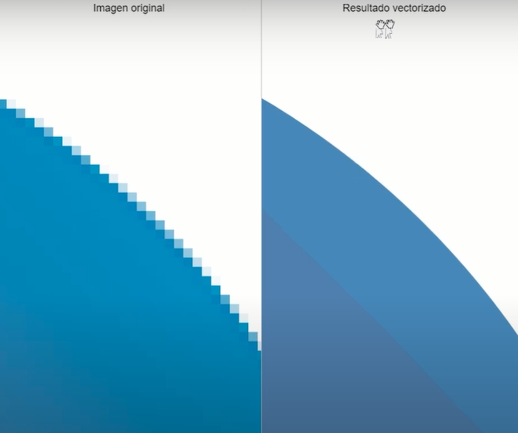
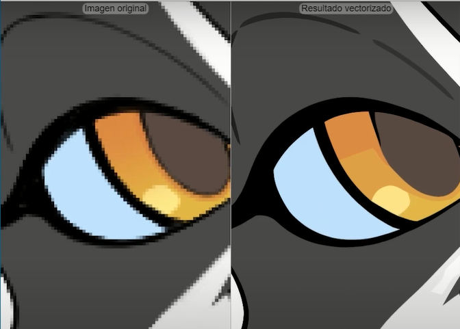

# ¿Qué es el contenido embebido?  
  
[Inicio |](../README.md) [Anterior |]() [Siguiente](2insertar_imagenes.md)

**El contenido embebido es todo el contenido que nos traemos desde fuera.**

Eso va a incluir imágenes, videos, audio y todos esos archivos que nos traemos que no forman parte de nuestro código pero que sí tienen que formar parte de nuestro sitio web.

**Estos archivos son los que más peso (tamaño) añaden a un sitio web.**

Los más conocidos son:
- Imágenes
- Audio
- Video
- Iframes

## Imágenes

Los formatos de imágenes para web los podemos clasificar en 2 tipos:

- **Vectoriales svg** (recomendado siempre que se pueda).  
No añaden peso a nuestra web. Son las imágenes de adorno como lo son los logotipos e íconos de redes sociales. 

- **Mapa de bits**
	- jpg
	- png de 8 y 24 (si necesitáis transparencias)
	- gif (si necesitáis una imagen animada)
	- webp (el formato que menos pesa)

**Webp** es un formato que ha sacado Google, es el más adecuado siempre y cuando no se trate de una imagen vectorial. Es muy recomendable que todas vuestras imágenes las convirtáis a webp para subirlas a una web. 
Este formato admite tanto transparencias como animación, es decir jpg, png y gif. 

Hay algunos navegadores antiguos que no soportan webp. En estos casos es recomendable hacer un **fallback**, que es decirle al navegador, *"usa esta imagen en formato webp y si no la entiendes usa ésta otra, en jpg, gif o png según haga falta"*. 


## Imágenes de bits vs Imágenes vectoriales

Al hacer zoom vemos como las imágenes van perdiendo calidad, se difuminan los bordes, se pixela la imagen, etc.

Para el ejemplo usaremos esta herramienta de pago online: [vector_magic](https://es.vectormagic.com/) que sirve para vectorizar imágenes y así mejorar su calidad.


Tenemos 3 imágenes de bits que vamos a vectorizar para ver la diferencia entre una imagen de bit y la misma imagen vectorizada.


Como podemos observar los cambios en la calidad de las imágenes vectorizadas son notables. 








Lo que nos permite el formato svg es que la imagen nunca pierda calidad mientras aumenta su resolución porque es el navegador el que calcula dónde tiene que pintar en función del zoom que hagamos.

**svg** es el formato de archivo vectorial que sólo se puede abrir en un navegador y eso es porque al ser svg consta de coordenadas que le estamos dando al navegador para que pinte la imagen.

Para pintar esta imagen  el navegador usa las siguientes coordenadas:

```html
<svg width="17" height="16" xmlns="http://www.w3.org/2000/svg"><path d="M16.539 6.097a.297.297 0 00-.24-.202l-5.36-.779L8.542.26a.296.296 0 00-.53 0L5.613 5.117l-5.36.779a.297.297 0 00-.165.505l3.88 3.78-.917 5.34a.297.297 0 00.43.312l4.795-2.52 4.794 2.52a.296.296 0 00.43-.313l-.916-5.338L16.464 6.4c.08-.08.11-.197.075-.304z" fill="#EF9546" fill-rule="nonzero"/></svg>
```
  
Recuerda, siempre es recomendable usar svg para las imágenes de adorno como logotipos, iconos, iconos de redes sociales, todas las imágenes que no sean relevantes en la web.


## Imágenes de bits WEBP

Las imágenes de bits están compuestas por pequeños cuadrados que se llaman **píxeles**. A mayor tamaño de la imagen más pixeles tenemos. Al hacer zoom en la imagen podemos verlos mejor. 


**Éstas imágenes añaden peso a la web. Cuanto mayor resolución tenga la imagen mayor peso va a añadir a nuestra web.**


Tenemos imágenes en formatos jpg, png y gif.

**JPG**, es el formato más comprimido pero no soportan animaciones ni transparencias.

**PNG**, soportan transparencias.

**GIF**, soportan animaciones. 

Ahora veamos cuál es el formato más adecuado para web y así poder trabajar con el menor peso posible.

Recordemos que las ventajas de usar el formato WEBP es que la imagen está mucho más comprimida sin perder calidad. Además soporta jpg, png y gif.

Utilizaremos la herramienta [image-online-convert](https://image.online-convert.com/) para convertir las imágenes a WEBP.

Al ser formato para web por defecto se abre con un navegador.

Luego de convertir a webp y descargar las imágenes, podemos comprobar como ha disminuido el tamaño de las imágenes desde "Propiedades de la imagen". De esta forma optimizamos la carga de nuestra web.


## Comparación de imágenes 

| Imagen original | Formato WEBP |
| :------: | ----------- |
|  |  |
|  |  |
|  |  |


---
   [¿Qué es el contenido embebido?](https://youtu.be/1wQIu0Jar5M)


 [Curso HTML 2020/2021](https://github.com/DorianDesings/html-2020-2021)  

---
[Inicio |]() [Anterior |]() [Siguiente](2insertar_imagenes.md)
