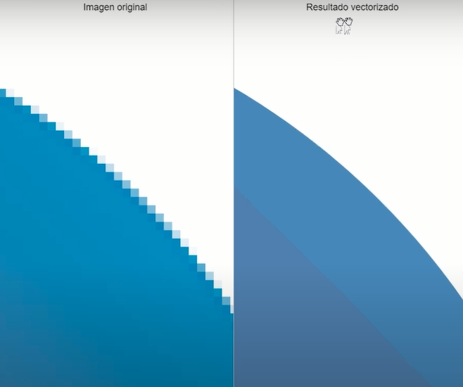
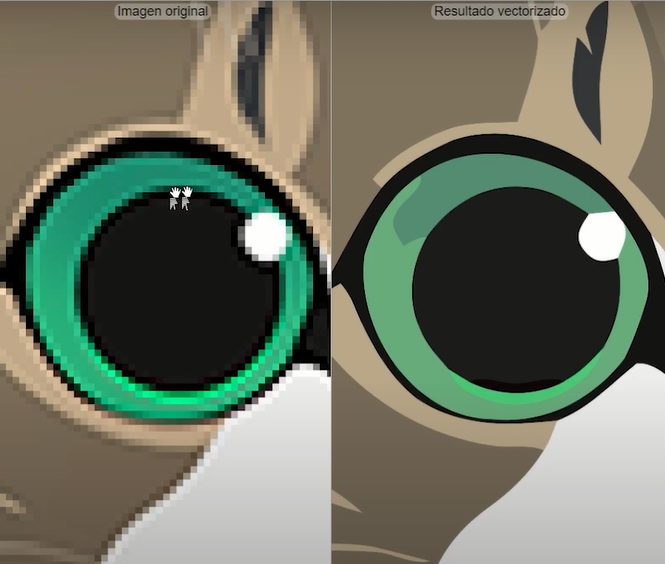

# Imágenes de bits vs Imágenes vectoriales

[Inicio |](README.md) [Anterior |](1contenido_embebido.md) [Siguiente](3webp.md)

Al hacer zoom vemos como las imágenes van perdiendo calidad, se difuminan los bordes, se pixela la imagen, etc.

Para el ejemplo usaremos esta herramienta de pago online: [vector_magic](https://es.vectormagic.com/) que sirve para vectorizar imágenes y así mejorar su calidad.


Tenemos 3 imágenes de bits que vamos a vectorizar para ver la diferencia entre una imagen de bit y la misma imagen vectorizada.


Como podemos observar los cambios en la calidad de las imágenes vectorizadas son notables. 







Lo que nos permite el formato svg es que la imagen nunca pierda calidad mientras aumenta su resolución porque es el navegador el que calcula dónde tiene que pintar en función del zoom que hagamos.

**svg** es el formato de archivo vectorial que sólo se puede abrir en un navegador y eso es porque al ser svg consta de coordenadas que le estamos dando al navegador para que pinte la imagen.

Para pintar esta imagen  el navegador usa las siguientes coordenadas:

```html
<svg width="17" height="16" xmlns="http://www.w3.org/2000/svg"><path d="M16.539 6.097a.297.297 0 00-.24-.202l-5.36-.779L8.542.26a.296.296 0 00-.53 0L5.613 5.117l-5.36.779a.297.297 0 00-.165.505l3.88 3.78-.917 5.34a.297.297 0 00.43.312l4.795-2.52 4.794 2.52a.296.296 0 00.43-.313l-.916-5.338L16.464 6.4c.08-.08.11-.197.075-.304z" fill="#EF9546" fill-rule="nonzero"/></svg>
```
  
Recuerda, siempre es recomendable usar svg para las imágenes de adorno como logotipos, iconos, iconos de redes sociales, todas las imágenes que no sean relevantes en la web.


---
   [Imágenes de bits vs Imágenes vectoriales](https://youtu.be/98ASXdmDiNY)


 [Curso HTML 2020/2021](https://github.com/DorianDesings/html-2020-2021)  

---
[Inicio |](README.md) [Anterior |](1contenido_embebido.md) [Siguiente](3webp.md)
