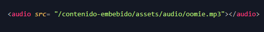
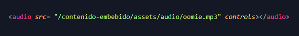
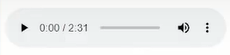
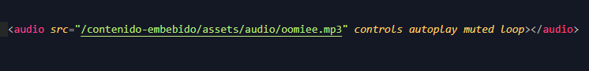

# Etiqueta audio

[Inicio |](../README.md) [Anterior |](5etiqueta_picture.md) [Siguiente](7etiqueta_video.md)

Agregaremos una canción mp3 a nuestro html. Pero primero guardaremos un archivo mp3 en la carpeta audio dentro de assets, como muestra el ejemplo.

Insertamos la etiqueta `<audio>` y vemos que al igual que las imágenes tiene un atributo src, el cual es para indicar la ruta donde se encuentra nuestra canción.

Si aquí guardamos no aparece nada en absoluto. Para agregar los controles de reproducción usaremos el atributo booleano `controls`.  

Ahora al guardar veremos los controlos de audio:

También tenemos el atributo `autoplay` que permite reproducir automáticamente la canción al cargar la página. Pero atención, los navegadores actuales están bloqueando el autoplay siempre y cuando el contenido no esté silenciado. Es decir, el autoplay automáticamente se desactiva si el contenido puede molestar al usuario con audio. 

Encontramos una solución a este problema, que es tener silenciado el autoplay con el atributo `muted`. De esta forma los navegadores no bloquearían el autoplay. Este es el caso de Instagram donde podemos elegir si queremos escuchar los videos que vemos al hacer scroll con sólo hacer click en ellos. 

Recuerda que es posible que en local la canción se reproduzca automáticamente pero al estar en un dominio real es muy probable que falle si no teneis este problema en cuenta.  

También contamos con el atributo `loop` para que el audio se reproduzca automáticamente cada vez que finaliza.
  

---
 [Etiqueta Audio](https://youtu.be/kbwhI5nHb-M)

 [Curso HTML 2020/2021](https://github.com/DorianDesings/html-2020-2021)  

---

[Inicio |]() [Anterior |](5etiqueta_picture.md) [Siguiente](7etiqueta_video.md)
