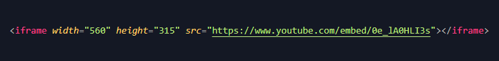
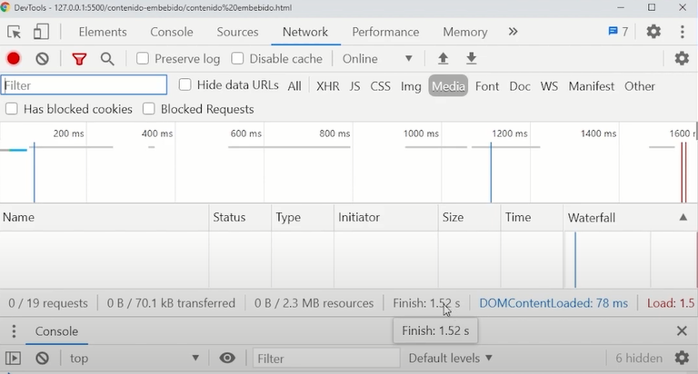

# Iframes

[Inicio |](../README.md)  [Anterior |](7etiqueta_video.md) [Siguiente](9etiqueta_figure.md)  

Usamos iframes para tomar contenido de otro sitio e insertarlo dentro de nuestra web.

Como ejemplo vamos a tomar un iframe de un video de youtube.

1. Haciendo click en la opción compartir video en Youtube seleccionamos insertar.

2. Copiamos en nuestro código el código del iframe que nos dan.

3. Una vez copiado el iframe podemos ver el video de Youtube insertado en nuestra web.

La sintaxis básica del iframe es:

Desde el inspector de chrome podemos ver lo que tarda en cargar solo este video, casi 2 segundos y eso porque dentro de cada iframe tenemos prácticamente una mini web.

Por este motivo no es buena idea abusar de los iframes porque van a ralentizar mucho la carga de nuestra web.

---
 [Etiqueta Iframe](https://youtu.be/hAgrrW5LM6M)

 [Curso HTML 2020/2021](https://github.com/DorianDesings/html-2020-2021)  

---
[Inicio |]() [Anterior |](7etiqueta_video.md) [Siguiente](9etiqueta_figure.md)  
