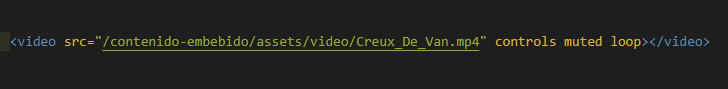
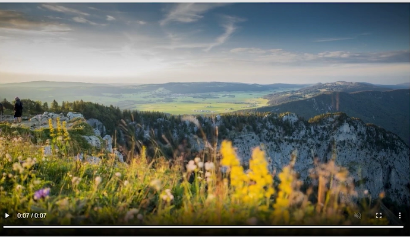
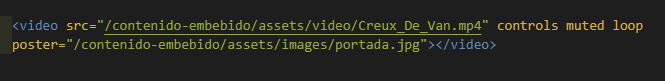

# Etiqueta video

[Inicio |](README.md)  [Anterior |](8etiqueta_audio.md) [Siguiente](10iframes.md)  

La etiqueta `<video>` cuenta con los mismos atributos que audio.

Para el ejemplo primero bajaremos un video sin copyright para poder usarlo en nuestra web.

Indicaremos la ruta donde se encuentra el video usando el atributo `src` y agregaremos los controles de video con el atributo `controls`.

Luego agregaremos el atributo `loop` para que el video vuelva a reproducirse desde el principio cuando termine.

Al igual que lo hacemos con las imágenes le damos un max-width de 100% para que no desborde el video.

También podemos agregar el atributo `<poster>` para indicarle cuál será la imagen inicial antes de reproducir el video (sería como la miniatura si habláramos de Youtube). Al atributo poster le agregamos la ruta donde se encuentra la imagen.

Pero atención que si agregamos autoplay cuando tenemos el atributo poster la imagen de poster no se llega a ver.

---
 [Etiqueta Video](https://youtu.be/Arlyf01AJAI)

 [Curso HTML 2020/2021](https://github.com/DorianDesings/html-2020-2021)  

---

[Inicio |](README.md)  [Anterior |](8etiqueta_audio.md) [Siguiente](10iframes.md)  
