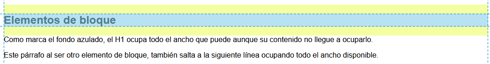

# Elementos de bloque

[Inicio](../README.md) [Anterior](j_aside.md) [Siguiente](k_elementos-de-bloque.md)

Los elementos de bloquer son aquellos elementos que ocupan todo el ancho disponible para ocupar aunque el contenido no lo haga, por lo tanto cada elemento de bloque que sea añadido a continuación saltarán a la siguiente línea.

Un elemento de bloque en vista de desarrollador de Firefox

